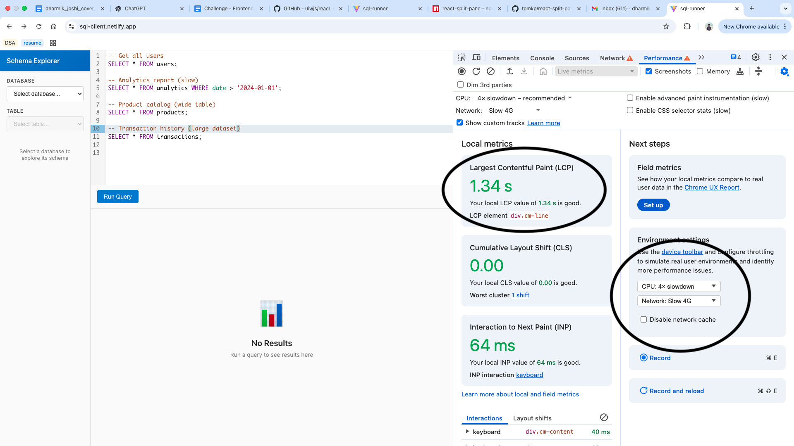
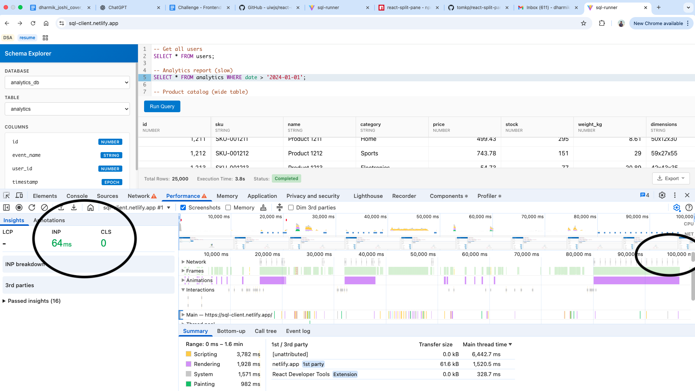
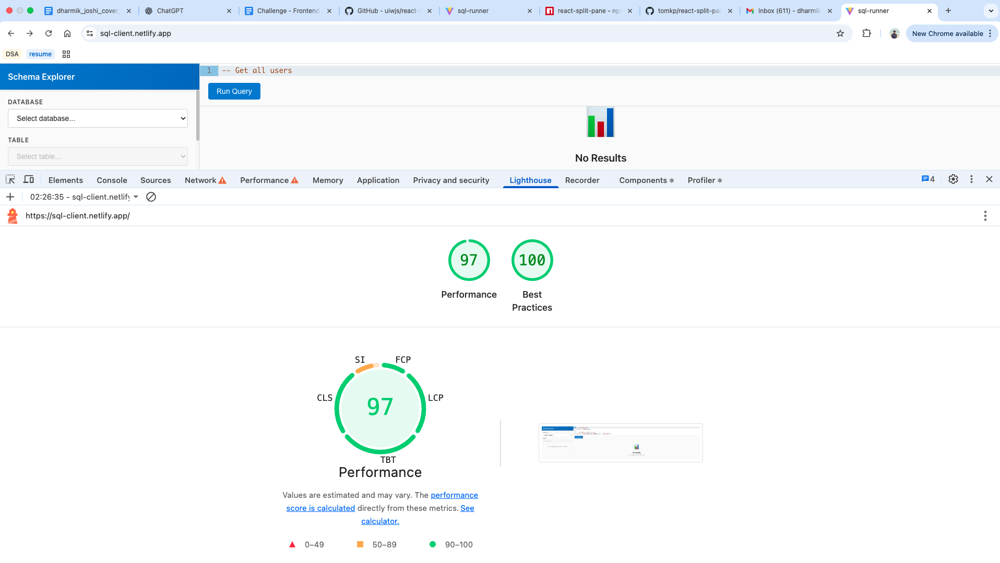

# SQL Runner

A high-performance, web-based SQL query runner component designed for speed and usability. This application allows users to execute SQL queries and visualize results efficiently, even with large datasets.

## Walkthrough

-   **Live Demo**: [https://sql-client.netlify.app](https://sql-client.netlify.app)

-   **Walkthrough Video**: [Google Drive](https://drive.google.com/file/d/16pYZpr6XdI3eYEeO_dFioYe_wDD_aJi_/view?usp=sharing)

## Features

### Core Features
*Essential functionality that makes the SQL runner immediately usable for data analysts.*

-   **Query Editor**: Built with [CodeMirror](https://uiwjs.github.io/react-codemirror/), featuring SQL syntax highlighting, line numbers, and auto-completion capabilities.

-   **Virtualized Results Table**: Powered by [@tanstack/react-virtual](https://tanstack.com/virtual/v3), capable of rendering 100,000+ rows without performance degradation by only rendering what is in the viewport.
    - *Why it matters*: Analysts often work with large datasets. Traditional tables crash or freeze the browser with thousands of rows. Virtualization ensures smooth scrolling and instant results, even for complex queries returning massive datasets.

-   **Loading, Error & Empty States**: Clear visual feedback during query execution and informative error messages when queries fail.

### Advanced Features
*Enhanced capabilities that improve productivity and user experience throughout the workday.*

-   **Query selection & Keyboard Shortcuts**: Execute queries instantly with `Cmd/Ctrl + Enter`, or select specific SQL statements to run only the selected portion.

-   **Query Cancellation**: Stop long-running queries mid-execution with a dedicated cancel button.
    - *Why it matters*: Analysts sometimes accidentally run expensive queries or realize mid-execution that they need to modify the query. Being able to cancel saves time and system resources.

-   **Sticky Headers & First Column**: Table headers and the first column remain visible while scrolling, providing constant context.
    
-   **Results Metadata**: Display query execution time, row count, and other relevant statistics.
    - *Why it matters*: Performance metrics help analysts optimize queries. Knowing a query took 5 seconds vs 500ms informs decisions about indexing, query structure, and whether the query is production-ready.

-   **Smart Data Formatting**: Automatic formatting of epoch timestamps and complex JSON/array data with expandable modal viewers.
    - *Why it matters*: Raw epoch timestamps (e.g., `1703779200000`) are unreadable. Automatic conversion to human-readable dates saves mental overhead. Similarly, viewing complex nested data in a formatted modal is far easier than parsing raw JSON strings.
    
-   **Split Pane Layout**: Fully resizable workspace using [react-split-pane](https://github.com/tomkp/react-split-pane), allowing users to adjust the ratio between the schema explorer, editor, and results view.

-   **Persistent Query State**: Queries are automatically saved to local storage and restored on page reload.
    - *Why it matters*: Analysts often work on multiple queries throughout the day. Accidental tab closures or browser crashes shouldn't mean lost work. Auto-persistence ensures continuity and reduces frustration.

-   **Resizable Table Columns**: Drag column borders to adjust widths based on content.
    
-   **Schema Explorer**: An intuitive sidebar to explore databases, tables, and column metadata, serving as a quick reference while writing queries.
    - *Why it matters*: Analysts constantly need to reference table structures and column names. Having this information readily available eliminates context-switching to external documentation speeding up query development.

-   **Data Export**: Built-in functionality to export query results to CSV/JSON for external analysis.

-   **Notification System**: Optional "Notify Me" button for long-running queries that sends a browser notification when the query completes.
    - *Why it matters*: For queries that take minutes to run, analysts can switch to other tasks and get notified when results are ready, rather than watching a loading spinner.

## Technology Stack & Key Libraries

-   `React`, `Vite`, and `Typescript` - Framework and Build Tool
-   `React Context API` and `Custom Hooks` - State Management
-   `CSS Modules` - Styling
-   `@uiw/react-codemirror` - SQL Editor Interface
-   `@tanstack/react-virtual` - Efficient rendering of large result sets (virtualization)
-   `react-split-pane` - Resizable layout panes

## Performance & Optimizations

-   **Row Virtualization**: The results table uses virtualization to render only the visible rows. This allows the application to handle datasets of 100,000+ rows with constant memory usage and smooth scrolling.
-   **Data Loading with Pagination**: Pagination fetches only the data needed for the current viewport. Intelligent page caching prevents redundant API calls when scrolling back to previously viewed rows.
-   **Debounced Scroll Events**: Data fetches triggered by scrolling are debounced (550ms) to reduce API call frequency and prevent request waterfalls during rapid scrolling.
-   **Smart Row Caching**: Map-based cache provides O(1) row lookups and tracks currently loading pages to prevent duplicate fetch requests, ensuring each data page is fetched exactly once.
-   **Memoization**: `useMemo` and `useCallback` are strategically used to prevent unnecessary re-renders of components.

## Performance Metrics

### Page load time
- Performance tested using throttled CPU and network settings. 
- Recorded a LCP of 1.34s.



### Interaction performance
- Ran a 100-second interaction trace covering heavy scrolling, query loading, column and panel resizing
- Observed an INP of 64 ms and CLS score of 0.



### Overall performance
- Recorded a 97% overall Lighthouse performance score.




## Code Quality & Maintainability

- **Component-Based Architecture**: Each feature is isolated in its own folder with co-located styles and logic
- **Custom Hooks**: Reusable logic extracted into hooks like `useLocalStoragePersistence`, `useClickOutside`, and `usePolling`
- **CSS Modules**: Scoped styling prevents conflicts and makes components portable
- **TypeScript**: Full type safety catches errors at compile-time and serves as inline documentation
- **Context API Pattern**: Centralized state management that scales with application complexity
- **Separation of Concerns**: UI components, business logic, and data fetching are cleanly separated

## System Design & Architecture

This section explains the end-to-end architecture of the SQL Runner, focusing on the async query execution flow designed for data warehouse operations.

### Why Async Execution?

Data analysts typically run queries against data warehouses where queries can take seconds to minutes to complete. Synchronous HTTP requests would timeout, so we implement an **asynchronous execution model** with polling.

### Data Flow

```
User Action (Run Query)
    ↓
createQueryExecution() → returns executionId
    ↓
startPolling() 
    ↓
┌───────────────────────────────┐
│ Poll Loop (every 1000ms)      │
│   ↓                           │
│ getQueryExecution()           │
│   ↓                           │
│ Check status                  │
│   ├─ running → continue       │
│   ├─ completed → stop & fetch │
│   └─ failed → stop & error    │
└───────────────────────────────┘
    ↓
fetchRows(offset=0, limit=50)
    ↓
Update rowsMap cache
    ↓
Render ResultsTable (virtualized)
    ↓
User scrolls → loadMoreRows()
    ↓
fetchRows(offset=N, limit=50)
```

### API Endpoints

| Endpoint | Method | Purpose |
|----------|--------|---------|
| `/api/query/execute` | POST | Create execution, return `executionId` |
| `/api/query/execution` | GET | Get execution status and metadata |
| `/api/query/rows` | GET | Fetch paginated rows |
| `/api/query/cancel` | POST | Cancel running execution |
